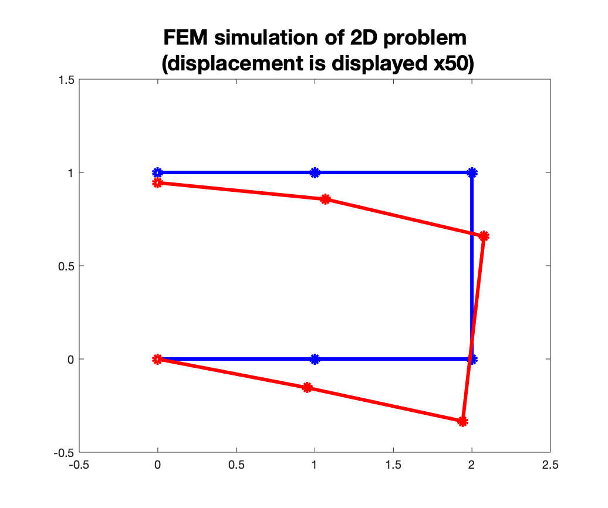

# FEM simulation for 2D plain strain problem
## Triangular finite element
```MATLAB
>> cd triangle
>> main
U2 =

         0
         0
   -0.0010
   -0.0031
   -0.0012
   -0.0067
    0.0015
   -0.0068
    0.0014
   -0.0029
         0
   -0.0011
```



## Quadrilateral finite element

```MATLAB
>> cd quadrilateral
>> main

```
